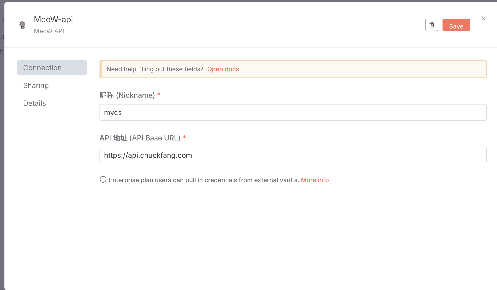
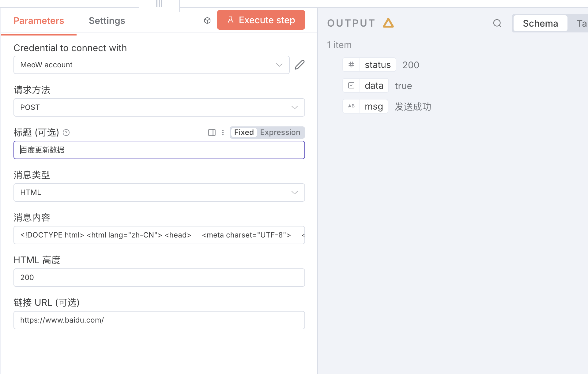

# n8n-nodes-meow

[](https://badge.fury.io/js/n8n-nodes-meow)
[](https://opensource.org/licenses/MIT)

这是一个用于 n8n 的自定义节点，可以通过 MeoW API 发送通知消息。

## 功能特性

- ✅ 支持发送文本和 HTML 格式的消息
- ✅ 支持 GET 和 POST 两种请求方式
- ✅ 可配置消息标题、内容、跳转链接
- ✅ 支持 HTML 消息的自定义显示高度
- ✅ 完整的错误处理和用户友好的界面
- ✅ 中文界面支持

## 安装

在你的 n8n 安装目录中运行：

```bash
npm install n8n-nodes-meow
```

然后重启你的 n8n 实例。

## 快速开始

### 1. 添加凭据

1. 在 n8n 中创建新的凭据
2. 选择 "MeoW API" 凭据类型
3. 填写以下信息：
   - **昵称 (Nickname)**: 你的 MeoW 用户昵称（不能包含斜杠）
   - **API 地址 (API Base URL)**: MeoW API 的基础地址（默认：`https://api.chuckfang.com`）

### 2. 使用节点

在工作流中添加 MeoW 节点，配置以下参数：

- **请求方式**: 选择 GET 或 POST 请求方式
- **标题**: 消息标题（可选，默认为 "MeoW"）
- **消息类型**: 选择 "纯文本" 或 "HTML" 格式
- **消息内容**: 要发送的消息内容（必填）
- **HTML 高度**: HTML 消息的显示高度（仅在 HTML 模式下生效）
- **跳转链接**: 点击消息后跳转的链接地址（可选）

## 界面截图

### 凭据配置



配置 MeoW API 凭据时需要填写：

- **昵称 (Nickname)**: 你在 MeoW 系统中的用户昵称
- **API 地址 (API Base URL)**: MeoW API 服务的基础地址

### 节点配置与执行



节点配置界面展示了：

- **参数配置**: 请求方式、标题、消息类型、消息内容等参数的设置
- **执行结果**: 成功发送消息后的响应状态（status: 200, data: true, msg: "发送成功"）

> 💡 **提示**: 消息类型选择为 "HTML" 时，会显示额外的 "HTML 高度" 参数，用于控制 HTML 内容的显示高度。

## 使用示例

### 发送简单文本消息

```json
{
  "requestMethod": "POST",
  "title": "系统通知",
  "message": "你好，这是一条测试消息",
  "msgType": "text"
}
```

### 发送 HTML 格式消息

```json
{
  "requestMethod": "POST", 
  "title": "欢迎消息",
  "message": "<h2>欢迎使用 MeoW</h2><p>这是一条 <b>HTML</b> 格式的消息</p>",
  "msgType": "html",
  "htmlHeight": 300,
  "url": "https://example.com"
}
```

### 典型工作流场景

1. **监控告警**: 当系统出现异常时自动发送通知
2. **任务完成提醒**: 长时间运行的任务完成后发送结果通知  
3. **数据同步通知**: 定时数据同步任务的状态更新
4. **用户交互反馈**: 用户操作后的确认和反馈消息

## 配置技巧

### 动态内容

你可以使用 n8n 的表达式语法来创建动态内容：

```json
{
  "title": "{{$node[\"数据源\"].json[\"title\"]}}",
  "message": "处理了 {{$node[\"数据源\"].json[\"count\"]}} 条记录",
  "msgType": "text"
}
```

### 条件发送

结合 n8n 的 IF 节点，可以根据条件决定是否发送通知：

- 仅在错误时发送告警
- 根据数据量决定通知级别
- 基于时间段控制通知频率

## 版本历史

### v0.1.5 (最新)

- 🔧 更新仓库地址为正确的 GitHub 仓库
- 👤 更新作者信息和联系方式
- 📝 修复文档中的链接地址

### v0.1.4

- 📸 添加界面截图，包含凭据配置和节点使用示例
- 📦 图片文件现在包含在 NPM 包中
- 📝 完善使用说明和配置技巧

### v0.1.3

- ✨ 优化参数显示顺序，消息类型现在显示在消息内容之前
- 📝 更新文档，添加界面截图和使用说明

### v0.1.2

- 🐛 修复 HTML 高度参数在文本模式下的获取错误
- 🔧 改进参数条件获取逻辑

### v0.1.1

- 🐛 修复节点文件空白导致的加载错误
- 📦 重新发布完整的构建文件

### v0.1.0

- 🎉 首次发布
- ✅ 支持 GET/POST 请求方式
- ✅ 支持文本和 HTML 消息格式
- ✅ 完整的参数配置和错误处理

## API 文档

更多关于 MeoW API 的详细信息，请参考：[MeoW API 文档](https://www.chuckfang.com/MeoW/api_doc.html)

## 开发

### 构建项目

```bash
npm run build
```

### 开发模式

```bash
npm run dev
```

### 代码格式化

```bash
npm run format
```

### 代码检查

```bash
npm run lint
```

## 贡献

欢迎提交 Pull Request 或创建 Issue 来改进这个项目。

## 许可证

MIT

## 支持

如果遇到问题或有功能建议，请在 [GitHub Issues](https://github.com/yingcaihuang/n8n-nodes-meow/issues) 中创建 issue。
